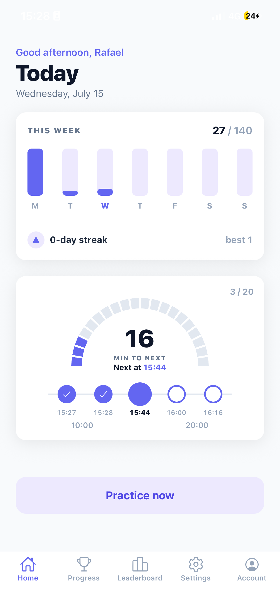
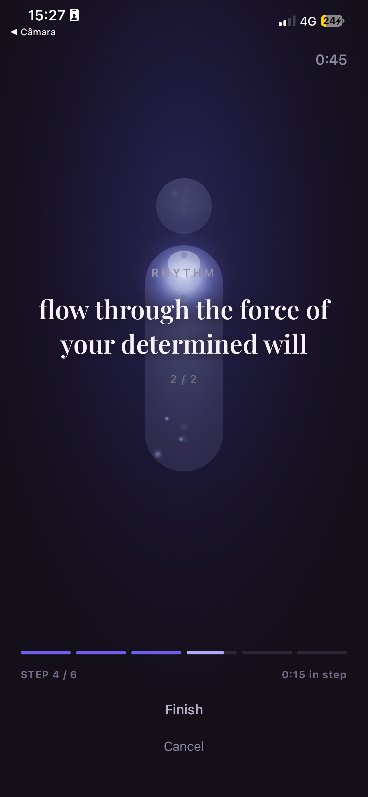
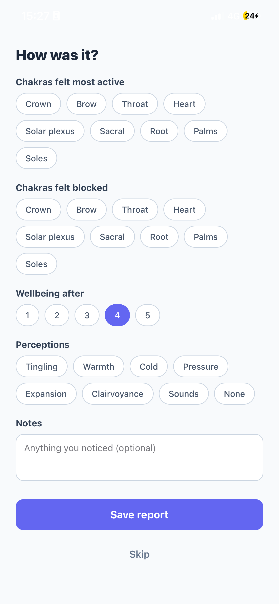
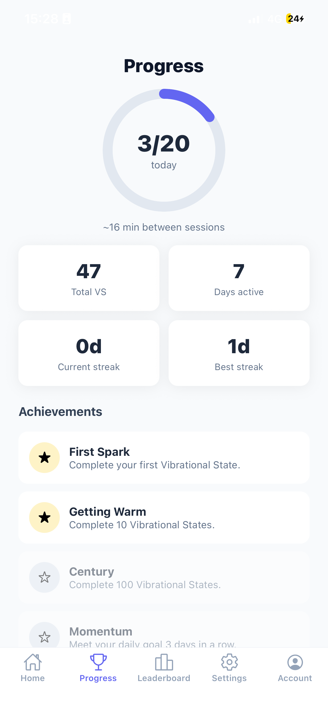

# Vibrational State (VS) Helper

A mobile app that helps you practice the **Vibrational State (VS / _Estado Vibracional_)** — a
bioenergetic self-defense technique from Conscientiology — many times throughout your day.

Because the technique is meant to be repeated ~20 times daily, the app schedules
evenly-spaced reminders, guides you through each session, lets you log how it
felt, and tracks your streaks, stats, and achievements. Built with **Expo**
(React Native), it runs fully on-device and can optionally sign in with
**Google via AWS Cognito** to sync your history to the cloud.

<p align="center">
  
  
  
  
</p>

<p align="center">
  <sub>Dashboard &nbsp;·&nbsp; Guided practice &nbsp;·&nbsp; Post-session report &nbsp;·&nbsp; Progress &amp; achievements</sub>
</p>

## What it does

- **Schedule** — set how many times a day you want to practice and a daily window
  (first & last time); the app computes evenly-spaced practice times for you.
- **Reminders** — local notifications fire at each scheduled time, no server required.
- **Guided practice** — a calm, step-by-step screen walks you through the 6
  maneuvers (Impulsion → Sensations → Repetition → Rhythm → Circuits → Installation)
  with a per-step timer.
- **Post-session report** — optionally log active/blocked chakras, wellbeing,
  perceptions, and notes right after a session.
- **Progress & gamification** — daily goal ring, weekly bars, streaks, lifetime
  stats, and unlockable achievements.
- **Leaderboard** — opt-in ranking against other practitioners (requires sign-in).
- **Optional login** — works fully offline; sign in with Google to sync settings,
  sessions, and stats across devices.

## The 6 maneuvers

The Vibrational State is the deliberate, will-driven dynamization of the
_energosoma_ (energy body) to keep energetic self-defense active. A single
session is:

1. **Impulsion** — stand upright, drive energy from head to hands and feet.
2. **Sensations** — bring the flow back from feet to head; feel its direction.
3. **Repetition** — repeat ~10 times, sweeping the body's organs.
4. **Rhythm** — gradually increase the speed of the flow.
5. **Circuits** — expand the flow into ever-larger circuits inside and outside the body.
6. **Installation** — install the VS; the whole energetic field becomes "lit".

## Tech stack

| Area          | Choice                                                        |
| ------------- | ------------------------------------------------------------- |
| App           | Expo (React Native), `expo-router`, TypeScript                |
| State / data  | `@tanstack/react-query`, AsyncStorage (on-device persistence) |
| Notifications | `expo-notifications` (local, scheduled)                       |
| Auth          | AWS Cognito + Google OAuth 2.0 (PKCE) via `expo-auth-session` |
| Backend (opt) | AWS CDK — API Gateway + Lambda + DynamoDB                     |

## Monorepo layout

This is an npm-workspaces monorepo. Dependencies are hoisted to the root
`node_modules`, so always run `npm install` from the repository root.

```
aws-cognito-template/
├── apps/
│   └── vs-helper/               # The Expo app
│       ├── app/                 # expo-router screens
│       │   ├── (tabs)/          #   Home · Progress · Leaderboard · Settings · Account
│       │   ├── practice.tsx     #   Guided VS session
│       │   └── report.tsx       #   Post-session report
│       └── src/
│           ├── features/vs/     #   schedule, notifications, storage, sync, achievements…
│           ├── components/      #   UI (ProgressRing, WeekCard, PracticeStep…)
│           └── features/i18n/   #   translations
├── packages/
│   ├── auth/                    # @vs/auth — Cognito/Google SSO (shared)
│   └── vs-shared/               # @vs/shared — types + stats logic shared with backend
├── infra/
│   └── vs-helper-backend/       # AWS CDK: optional cloud-sync + leaderboard API
└── docs/                        # Architecture, deployment & setup guides
```

## Prerequisites

| Tool                 | Version | Purpose                                  |
| -------------------- | ------- | ---------------------------------------- |
| Node.js              | ≥ 18    | Runtime                                  |
| Expo Go / Xcode      | latest  | Run on a device or the iOS Simulator     |
| AWS account          | —       | _Optional_ — Cognito login + cloud sync  |
| Google Cloud account | —       | _Optional_ — Google OAuth credentials    |

## Quick start

```bash
# 1. Install dependencies from the repo root (workspaces are hoisted)
npm install

# 2. Configure the app (login/sync are optional — see notes below)
cd apps/vs-helper
cp .env.example .env

# 3. Run it (from the repo root)
cd ../..
npm run vs          # start the Expo dev server
# then press "i" for the iOS Simulator, or scan the QR code with Expo Go
```

You can run the app immediately without touching `.env` — it works fully
on-device. Fill in the OIDC values only when you want Google login and cloud
sync. See [`docs/vs-helper-ios.md`](docs/vs-helper-ios.md) for the full
run-it-locally guide.

## Environment variables

All `EXPO_PUBLIC_*` values are inlined into the app bundle at build time — they
are **public, not secrets** (the App Client is a public PKCE client with no
secret). `OPENAI_API_KEY` is different: it is a build-time secret used only by
the local narration generator and is never referenced by the mobile app. They
live in `apps/vs-helper/.env`.

| Variable                          | Description                                                                    |
| --------------------------------- | ------------------------------------------------------------------------------ |
| `EXPO_PUBLIC_COGNITO_ISSUER`      | OIDC issuer `https://cognito-idp.<region>.amazonaws.com/<userPoolId>`          |
| `EXPO_PUBLIC_USER_POOL_CLIENT_ID` | Cognito App Client ID (public PKCE client)                                     |
| `EXPO_PUBLIC_LOGOUT_URI`          | Optional hosted-UI sign-out URL (e.g. `vshelper://`)                           |
| `EXPO_PUBLIC_APP_SCHEME`          | Must match `app.json → expo.scheme` (`vshelper`)                               |
| `EXPO_PUBLIC_API_BASE_URL`        | Optional cloud-sync backend URL — leave unset to run fully on-device           |
| `OPENAI_API_KEY`                  | Secret used locally to regenerate static narration; never shipped in the app   |
| `OPENAI_TTS_MODEL`                | Optional narration model override; defaults to `gpt-4o-mini-tts`               |
| `OPENAI_TTS_VOICE`                | Optional narration voice override; defaults to `marin`                         |

The generator also accepts the existing `EXPO_OPEN_API` name as a local alias,
but `OPENAI_API_KEY` is preferred because it makes the build-time-only purpose
clear. After changing any `maneuver.*.text` translation, regenerate and validate
the bundled files:

```bash
npm run audio:generate --workspace vs-helper
npm run audio:check --workspace vs-helper
```

## Documentation

- [Product & feature architecture](docs/vs-helper-architecture.md)
- [Run on iOS (Simulator / device)](docs/vs-helper-ios.md)
- [Cloud-sync backend (AWS CDK)](docs/vs-helper-backend.md)
- [Auth architecture](docs/architecture.md)
- [Cognito + Google SSO setup & deployment](docs/deployment.md)

## License

MIT
