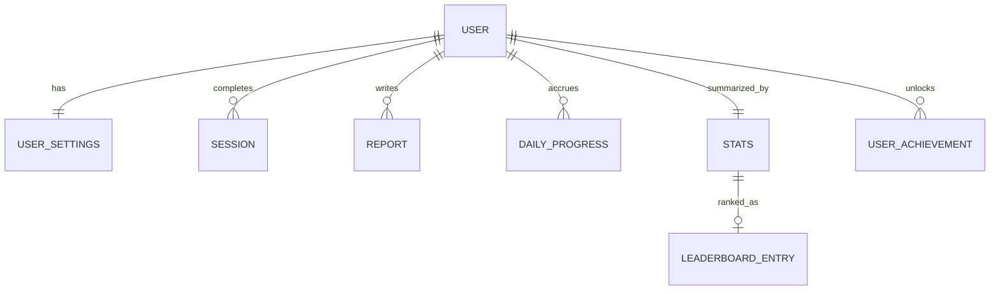

# Vibrational State (VS) Helper — Architecture

> Feature architecture for the **Vibrational State helper**, built on top of the
> existing Expo + AWS Cognito (Google SSO) authentication template. Authentication
> is already in place (see [`architecture.md`](architecture.md)); this document
> covers the VS-specific product.
>
> **Scoping:** the VS helper is its **own app** (`apps/vs-helper`). The existing
> `mobile/` auth template stays **untouched** as a reference; its auth logic is
> extracted into a shared workspace package (`packages/auth`, `@vs/auth`) that the
> VS app consumes. See [§7 Monorepo Structure](#7-monorepo-structure).
>
> **Running it:** to serve the app on iOS (Simulator or a physical iPhone via
> Expo Go), see [`vs-helper-ios.md`](vs-helper-ios.md).

## 1. What is the Vibrational State?

The **Vibrational State (EV — _Estado Vibracional_)** is a bioenergetic self-defense
technique from Conscientiology. It is the deliberate, maximal dynamization of the
_energosoma_ (energy body) energies, driven by the will, to keep energetic
self-defense (_paraprofilaxia_) active throughout the day.

The source technique recommends practicing **~20 times per day**, in different
situations (leaving home, entering a vehicle, before a difficult conversation,
in a crowd, when feeling unwell, etc.). The practice itself is 6 basic maneuvers:

1. **Impulsion** — stand upright, drive energy from head to hands and feet.
2. **Sensations** — bring the flow back from feet to head; feel its direction.
3. **Repetition** — repeat ~10 times, sweeping the body's organs.
4. **Rhythm** — gradually increase the speed of the flow.
5. **Circuits** — expand the flow into ever-larger circuits inside and outside the body.
6. **Installation** — install the VS; the whole energetic field becomes "lit".

### Product goal

Because the technique is meant to be repeated many times a day, a **mobile app** is
the ideal companion. The app helps the user:

- Set **how many times** per day they want to practice.
- Define a **daily window** (first and last practice times).
- Automatically compute and **remind** the user of the **next practice times**.
- Offer a **simple guided practice screen** to run a single VS session.
- (Later) Track streaks and history for motivation.

## 2. Scope — Phase 1 (MVP)

| In scope (MVP)                                                        | Out of scope (later)                       |
| --------------------------------------------------------------------- | ------------------------------------------ |
| Set target count/day + first & last time                              | Cloud sync of settings/history             |
| Set **session duration** (default 2 min, adjustable)                  | Social / group ("equipe harmonizada") mode |
| Compute evenly-spaced reminder times                                  | Apple Watch / wearables                    |
| Local notifications for each scheduled time                           | Advanced analytics dashboards              |
| "Do the VS now" guided practice screen with timer                     | Music/orgasm potentializer integrations    |
| Post-session **report** (skippable): chakras, wellbeing, perceptions  | Multi-language content authoring UI        |
| **Gamification**: daily progress, statistics & achievements tab       | Global **leaderboard** / all-users scores  |
| **First-run onboarding** into settings before the dashboard           |                                            |
| **Optional login** (advisable — enables cross-session history / sync) |                                            |
| Mark a session complete; simple daily progress                        |                                            |
| Persist settings, progress & reports on-device                        |                                            |

## 3. High-Level Architecture

```
┌───────────────────────────────────────────────────────────────┐
│                          Device                               │
│                                                               │
│  ┌─────────────────────────────────────────────────────────┐  │
│  │              VS App (apps/vs-helper/)                   │  │
│  │                                                         │  │
│  │  app/ (expo-router screens)                             │  │
│  │   - index          → dashboard: next time + progress    │  │
│  │   - practice       → guided VS session                  │  │
│  │   - settings       → schedule config                    │  │
│  │   - stats          → progress / achievements            │  │
│  │                                                         │  │
│  │  src/features/vs/                                       │  │
│  │   - schedule.ts    → compute practice times             │  │
│  │   - storage.ts     → persist settings + daily progress  │  │
│  │   - notifications.ts → schedule/cancel local notifs     │  │
│  │   - useSchedule.ts → React hook (state + actions)       │  │
│  │                                                         │  │
│  │  @vs/auth (packages/auth — shared library)              │  │
│  │   - Cognito/Google SSO → tokens in expo-secure-store    │  │
│  │                                                         │  │
│  │  Storage                                                │  │
│  │   - expo-secure-store → auth tokens (via @vs/auth)      │  │
│  │   - AsyncStorage      → VS settings + progress          │  │
│  │  expo-notifications → local scheduled reminders         │  │
│  └─────────────────────────────────────────────────────────┘  │
└───────────────────────────────────────────────────────────────┘
                            │ (Phase 2, optional)
                            ▼
              ┌────────────────────────────────────┐
              │  AWS (existing Cognito auth)       │
              │  + infra/vs-helper-backend:        │
              │    API GW + Lambda + DynamoDB       │
              │    for Settings/Sessions/Stats sync │
              └────────────────────────────────────┘
```

Phase 1 is **fully offline / on-device**. **Login is optional** (advisable for
cross-session history); Cognito auth already exists but no longer gates the app.
VS data stays local until the user signs in, at which point Settings and
Sessions sync in the background — see [`vs-helper-backend.md`](vs-helper-backend.md)
for what's shipped and what's still on-device only (Reports, richer stats, leaderboard).

## 4. Navigation & Screens

Using `expo-router` in `apps/vs-helper`, file-based routes:

```
app/
├── _layout.tsx         # root stack (existing); login optional, no gate
├── index.tsx           # Dashboard
├── practice.tsx        # Guided VS session
├── report.tsx          # Post-session report (skippable)
├── stats.tsx           # Progress, statistics & achievements
└── settings.tsx        # Schedule configuration
```

As the app grows, the root can become a bottom **tab bar**
(Dashboard · Stats · Settings) with `practice`/`report` pushed as modal routes.

### 4.0 First-run gate

A `configured` boolean records whether the user has completed the initial setup.
On app open, `_layout.tsx` reads settings and:

- **`configured === false`** → redirect to **Settings** in onboarding mode, so the
  user first defines their times-per-day and daily window. Saving flips `configured`
  to `true`.
- **`configured === true`** → go straight to the **Dashboard** (default screen).

The flag is independent of login — onboarding works signed-out.

### 4.1 Dashboard (`index.tsx`)

The home screen (available signed-in or signed-out).

- **Next practice** time (large, prominent) + countdown.
- **Today's progress**: e.g. `7 / 20 done`.
- Primary button: **"Do the Vibrational State now"** → `practice`.
- Secondary: link to **Settings**.
- If signed-out, a non-intrusive **"Sign in to save your progress"** prompt.

### 4.2 Practice screen (`practice.tsx`)

A simple, focused screen to run one VS session.

- Minimal, distraction-free UI (the source warns against "crutches").
- Optional step guidance for the 6 maneuvers (can be toggled off for veterans).
- A **session timer** counts down the configured `sessionDurationSec`
  (default **2 minutes**); the user can start, and the session auto-completes
  when the timer reaches zero (or the user can finish early).
- On finish → mark the current slot complete, update progress, then navigate to the
  **report** screen (which can be skipped for on-the-run practice).

**Next step — audio guide**: today's guided steps are text-only (phrases
crossfading over the illustration, per §4.2 above). Add an optional spoken
audio guide that narrates each of the 6 maneuvers in sync with the step
timer, so the practice can run eyes-closed. Should respect the same
`showGuidedSteps` toggle (or a new dedicated one), ship per-language voice
lines matching the existing `maneuver.*` translation keys, and mute cleanly
when the device is on silent/DND.

### 4.3 Report screen (`report.tsx`)

An optional post-session reflection shown after a session completes. Designed to be
**skippable in one tap** for someone practicing on the run.

- **Chakras felt most active** — multi-select over the holochakra centers.
- **Chakras felt blocked** — multi-select over the same list.
- **Wellbeing after** — how well the person feels now (e.g. a 1–5 scale).
- **Perceptions** — multi-select (e.g. tingling, warmth, cold, pressure, expansion,
  clairvoyance, sounds, none).
- **Notes** — optional free text.
- **Skip** — dismisses the report and returns to the dashboard without saving one
  (the session still counts as completed).
- **Save** — persists a `SessionReport`; if signed-out, gently notes that signing in
  would let these reports be counted and synced across sessions.

### 4.4 Settings screen (`settings.tsx`)

- **Times per day** (default 20, per the technique).
- **First time** of day (e.g. 07:00).
- **Last time** of day (e.g. 22:00).
- **Session duration** (default 2 minutes; user-adjustable).
- Toggle: **enable notifications**.
- Toggle: **show guided steps** on the practice screen.
- Save → recompute schedule + reschedule notifications.

### 4.5 Stats & achievements screen (`stats.tsx`)

The gamification hub — turns consistent practice into visible progress.

- **Daily progress**: today's `completed / target` as a ring + the day's slots.
- **Streak**: current and best run of consecutive days that met the daily goal.
- **Statistics**: lifetime total VS, days active, daily average, most-active and
  most-blocked chakra, and a simple wellbeing trend (from saved reports).
- **Achievements**: milestone badges (e.g. first VS, 100 done, 7-day streak) shown
  locked/unlocked; new unlocks are evaluated after each completed session.
- All computed **on-device** from the local session history; signing in later lets
  these feed the future leaderboard (see §12).

## 5. Core Domain Logic

### 5.1 Schedule computation

Given `timesPerDay`, `firstTime`, and `lastTime`, compute evenly-spaced practice
slots across the window, so the day's practices are **distributed throughout the
first–last time range**. Changing any of these values in Settings recomputes the
slots (and reschedules notifications).

```ts
// src/features/vs/schedule.ts
export interface ScheduleConfig {
  timesPerDay: number; // e.g. 20
  firstTime: string; // "HH:mm" e.g. "07:00"
  lastTime: string; // "HH:mm" e.g. "22:00"
}

// Returns "HH:mm" slots evenly spaced from firstTime..lastTime (inclusive).
export function computeSlots(config: ScheduleConfig): string[];

// Given the slots and the current time, return the next upcoming slot (or null).
export function nextSlot(slots: string[], now: Date): string | null;
```

Spacing rule: with `n` times between `first` and `last` inclusive, the interval is
`(last - first) / (n - 1)` minutes. `n = 1` degenerates to a single slot at `first`.

### 5.2 Data model

```ts
export interface VSSettings {
  timesPerDay: number;
  firstTime: string; // "HH:mm"
  lastTime: string; // "HH:mm"
  sessionDurationSec: number; // length of one VS session; default 120 (2 min)
  notificationsEnabled: boolean;
  showGuidedSteps: boolean;
  configured: boolean; // false until the user completes first-run onboarding
}

export interface DailyProgress {
  date: string; // "YYYY-MM-DD" (local)
  completed: number; // sessions done today
  completedSlots: string[]; // "HH:mm" slots marked done
}

export type Chakra =
  | "coronochakra" // crown
  | "frontochakra" // brow / third eye
  | "laryngochakra" // throat
  | "cardiochakra" // heart
  | "umbilicochakra" // solar plexus
  | "sexochakra" // sacral
  | "basochakra" // root
  | "palmar" // palms
  | "plantar"; // soles

export interface SessionReport {
  slot: string; // "HH:mm" slot the session belonged to
  completedAt: string; // ISO timestamp
  chakrasActive: Chakra[]; // felt most active
  chakrasBlocked: Chakra[]; // felt blocked
  wellbeing: number; // 1..5, how well the person feels after
  perceptions: string[]; // tingling, warmth, clairvoyance, none, ...
  notes?: string; // optional free text
}

// One row per completed session, appended across days (drives stats/streaks).
export interface SessionRecord {
  date: string; // "YYYY-MM-DD" (local)
  slot: string; // "HH:mm"
  completedAt: string; // ISO timestamp
}

export interface LifetimeStats {
  totalSessions: number; // all VS ever completed
  daysActive: number; // distinct days with >=1 session
  currentStreak: number; // consecutive days meeting the daily goal
  bestStreak: number;
  lastActiveDate: string; // "YYYY-MM-DD"
}

export interface Achievement {
  id: string; // "first-vs", "century", "streak-7", ...
  title: string;
  description: string;
  unlockedAt: string | null; // ISO when unlocked; null while locked
}
```

### 5.3 Storage

- **Settings & progress** → `@react-native-async-storage/async-storage`
  (non-sensitive, structured app data).
- **Auth tokens** → `expo-secure-store` (existing, unchanged).
- Progress resets when the stored `date` no longer matches today's local date.

```ts
// src/features/vs/storage.ts
export function loadSettings(): Promise<VSSettings>;
export function saveSettings(s: VSSettings): Promise<void>;
export function loadTodayProgress(): Promise<DailyProgress>;
export function markSlotDone(slot: string): Promise<DailyProgress>;
export function saveReport(r: SessionReport): Promise<void>; // skipping saves none
export function appendSessionRecord(r: SessionRecord): Promise<void>;
export function loadHistory(): Promise<SessionRecord[]>; // for stats/achievements
```

### 5.4 Notifications

Local notifications via `expo-notifications` — no server/push needed in Phase 1.

- On settings save: cancel all existing VS notifications, then schedule one daily
  repeating notification per computed slot.
- Request permission on first enable; degrade gracefully if denied (in-app
  reminders only).

```ts
// src/features/vs/notifications.ts
export function requestPermission(): Promise<boolean>;
export function rescheduleAll(slots: string[]): Promise<void>;
export function cancelAll(): Promise<void>;
```

### 5.5 Gamification (stats & achievements)

Pure functions over the local `SessionRecord[]` history — no backend in Phase 1.

```ts
// src/features/vs/stats.ts
export function computeStats(
  history: SessionRecord[],
  goalPerDay: number,
): LifetimeStats;

// src/features/vs/achievements.ts
export const ACHIEVEMENTS: Achievement[]; // catalog (all locked by default)

// Returns achievements with newly-satisfied ones unlocked (unlockedAt set).
export function evaluateAchievements(
  stats: LifetimeStats,
  current: Achievement[],
): Achievement[];
```

After each completed session the app appends a `SessionRecord`, recomputes
`LifetimeStats`, and re-evaluates achievements, surfacing any new unlocks.

## 6. State Management

A single feature hook composes storage + schedule + notifications and exposes state
to the screens. No external state library needed for the MVP (React state + the hook).

```ts
// src/features/vs/useSchedule.ts
export function useSchedule(): {
  settings: VSSettings;
  configured: boolean; // drives the first-run redirect in _layout
  slots: string[];
  next: string | null;
  progress: DailyProgress;
  updateSettings: (partial: Partial<VSSettings>) => Promise<void>;
  completeCurrent: () => Promise<void>;
};
```

## 7. Monorepo Structure

The repo is a **workspace** (npm/pnpm workspaces). Auth is extracted into a shared
package; the VS helper is a separate app. `mobile/` stays as the original,
self-contained auth reference template and is **not** modified by the VS work.

```
aws-cognito-template/            # workspace root
├── package.json                 # workspaces: ["mobile", "packages/*", "apps/*"]
├── mobile/                      # existing auth template (reference — untouched)
├── packages/
│   └── auth/                    # shared Cognito + Google SSO library (@vs/auth)
│       ├── package.json         # name: "@vs/auth"
│       └── src/
│           ├── cognito.ts       # discovery doc + redirect URI
│           ├── auth.ts          # token exchange, storage, parsing
│           ├── LoginButton.tsx
│           ├── UserProfile.tsx
│           └── index.ts         # public API surface
└── apps/
    └── vs-helper/               # the Vibrational State app (Expo)
        ├── package.json         # depends on "@vs/auth"
        ├── app.json             # own scheme, bundle id
        ├── app/
        │   ├── _layout.tsx       # first-run gate; login optional
        │   ├── index.tsx         # Dashboard
        │   ├── practice.tsx      # Guided VS session
        │   ├── report.tsx        # Post-session report (skippable)
        │   ├── stats.tsx         # Progress, statistics & achievements
        │   └── settings.tsx      # Schedule config (+ first-run onboarding)
        └── src/
            ├── components/       # VS-specific UI
            │   ├── NextPracticeCard.tsx
            │   ├── ProgressRing.tsx
            │   ├── ReportForm.tsx
            │   ├── StatCard.tsx
            │   ├── AchievementBadge.tsx
            │   └── PracticeStep.tsx
            └── features/
                └── vs/
                    ├── schedule.ts
                    ├── storage.ts
                    ├── notifications.ts
                    ├── stats.ts
                    ├── achievements.ts
                    ├── useSchedule.ts
                    └── content.ts   # 6 maneuvers + situations + chakra labels
```

**Boundaries**

- `packages/auth` owns everything Cognito/SSO and exposes a small public API
  (`getStoredTokens`, `exchangeCodeForTokens`, `LoginButton`, `UserProfile`, …).
- `apps/vs-helper` owns all VS logic and imports auth **only** through `@vs/auth`;
  it never reaches into auth internals.
- `mobile/` remains a standalone template — safe to keep as the canonical auth
  example, or later retire once `packages/auth` is the single source of truth.

## 8. New Dependencies

| Package                                     | Purpose                     |
| ------------------------------------------- | --------------------------- |
| `expo-notifications`                        | Local scheduled reminders   |
| `@react-native-async-storage/async-storage` | Persist settings & progress |

Both are Expo-compatible and installed via `npx expo install` **inside
`apps/vs-helper`**. The repo uses **npm/pnpm workspaces**; `@vs/auth` is a local
workspace package the VS app depends on (no publishing required).

## 9. Auth Integration (optional login)

- **Login is optional.** The app is fully usable signed-out — settings, schedule,
  notifications, practice, and reports all work on-device without an account.
- **Signing in is advisable**: it lets the app associate completed sessions and
  reports with the user, so they can be counted toward history/streaks and, in
  Phase 2, synced across devices (keyed by the Cognito identity — email/name/picture
  from the ID token).
- Auth ships as the shared **`@vs/auth`** package (extracted from `mobile/`). The VS
  app imports its public API (e.g. `getStoredTokens`, `LoginButton`) — the Cognito +
  Google SSO flow itself is reused **unchanged** and simply no longer gates access.
  A non-intrusive “Sign in to save your progress” prompt surfaces on the dashboard
  and after a report is saved.

### 9.1 Android authentication

Auth on Android uses the same OIDC **Authorization Code + PKCE** flow: the Cognito
**Hosted UI** opens in a **Chrome Custom Tab** (`expo-web-browser`), Google is
federated inside that browser, and the result returns to the app through a deep
link. Because Google runs through Cognito's Hosted UI (a **web** OAuth client),
there is **no native Google Sign-In** and therefore **no SHA-1/SHA-256 fingerprint**
to register.

**App configuration** (`apps/vs-helper/app.json`)

- `expo.scheme: "vshelper"` — generates the Android intent filter that catches
  `vshelper://callback` in standalone builds.
- `expo.android.package: "com.rafaelflorespereira.vshelper"` — required for builds.
- `plugins: ["expo-router", "expo-secure-store", "expo-notifications"]`.

**Redirect URIs by environment** (register each in the Cognito App Client)

| Environment               | Android redirect URI                  |
| ------------------------- | ------------------------------------- |
| Expo Go (emulator)        | `exp://10.0.2.2:8081/--/callback`     |
| Expo Go (physical device) | `exp://<machine-ip>:8081/--/callback` |
| Standalone / EAS build    | `vshelper://callback`                 |

`makeRedirectUri()` in `@vs/auth` resolves the correct value at runtime; the app
logs it before `promptAsync()` so you can register the exact string.

**Notes**

- Tokens are stored in the Android **Keystore** via `expo-secure-store` (never in
  AsyncStorage).
- The Android emulator reaches your dev machine at `10.0.2.2`, not `localhost`.
- `WebBrowser.maybeCompleteAuthSession()` (in `_layout.tsx`) dismisses the Custom
  Tab after the redirect.
- Add `vshelper://` to the App Client **sign-out URLs** (mirrors `myapp://`).
- Cognito's Google identity provider keeps using the **Web** Google OAuth client
  already configured for `mobile/` — no separate Android OAuth client is needed.

## 10. Phased Roadmap

| Phase | Deliverable                                                                      | Status |
| ----- | --------------------------------------------------------------------------------- | ------ |
| 1     | On-device MVP: settings, schedule, notifications, practice, report, gamification | Done |
| 2     | Cloud sync of settings/sessions/stats (Cognito identity + API); richer statistics | Settings + Sessions + Stats sync shipped — see [`vs-helper-backend.md`](vs-helper-backend.md). Reports/achievements sync and richer statistics still open |
| 3     | Global **leaderboard**; situational reminders (the 20 situations); group mode; **audio guide** for the practice screen (§4.2) | Leaderboard shipped — see [`vs-helper-backend.md`](vs-helper-backend.md). Situational reminders, group mode, and the practice audio guide not started |

## 11. Leaderboard (scores window)

**Shipped** — a backend-backed feature that shows opted-in users and their
status — total Vibrational States done, current/best streak — ranked. See
[`vs-helper-backend.md`](vs-helper-backend.md) for the deployed `/profile` and
`/leaderboard` routes and `apps/vs-helper/app/(tabs)/leaderboard.tsx` for the
screen. `days active` is not shown on the board (only in the on-device Stats
tab); the ranking key is `totalSessions`.

- **Backend**: API Gateway + Lambda + DynamoDB, with requests authorized by the
  Cognito ID token; each user's aggregate is keyed by their Cognito `sub`.
- **Sync**: `Stats` is already recomputed server-side on every `POST /sessions`
  (§12.2); the leaderboard just indexes that same row via a GSI
  (`gsi1pk`/`gsi1sk`) when the user is opted in, so no separate push exists —
  the leaderboard reads aggregated, ranked rows straight off `Stats`.
- **Privacy**: **opt-in** only, set via `PUT /profile`. Users choose a display
  name/handle; sensitive report details (chakras, perceptions, notes) never
  leave the device — only coarse counts (`totalSessions`, streaks) are shared.
  Signed-out users are never listed, and opting out immediately drops the row
  from the GSI (DynamoDB only indexes items carrying the GSI's key attributes).
- **Screen**: `app/(tabs)/leaderboard.tsx` — top 50 ranks with an `isYou`
  highlight on the current user's row; no separate "your position" query yet
  if they're ranked below 50th.

## 12. Data & Database (cloud sync)

Phase 1 keeps everything on-device (AsyncStorage). **Phase 2** adds a backend
(**API Gateway + Lambda + DynamoDB**, `infra/vs-helper-backend`) that signed-in
users sync to, authorized by the Cognito ID token. Every record is owned by the
user's Cognito `sub` (`userId`), and requests are scoped to that `sub` so a
user can only touch their own partition. **Shipped so far**: `UserSettings`,
`Sessions`/`Stats`, and `Users` (§12.2 below, leaderboard opt-in fields only —
see [`vs-helper-backend.md`](vs-helper-backend.md) for the deployed API).
`Reports` and `UserAchievements` tables described below are **not yet built**.

### 12.1 Entity overview



### 12.2 Tables (DynamoDB)

A pragmatic multi-table design (a single-table design is noted in §12.4). All
tables partition by `userId`; time-series tables add a sort key (`sk`).

**Users** — profile & leaderboard opt-in (`PK: userId`)

| Attribute          | Type    | Notes                            |
| ------------------ | ------- | -------------------------------- |
| `userId`           | string  | Cognito `sub` (partition key)    |
| `email`            | string  | from the ID token                |
| `name`             | string  | full name from Google            |
| `picture`          | string  | avatar URL                       |
| `handle`           | string  | public leaderboard name (opt-in) |
| `leaderboardOptIn` | boolean | default `false`                  |
| `createdAt`        | string  | ISO timestamp                    |
| `updatedAt`        | string  | ISO timestamp                    |

**UserSettings** — one per user (`PK: userId`)

| Attribute              | Type    | Notes                         |
| ---------------------- | ------- | ----------------------------- |
| `timesPerDay`          | number  |                               |
| `firstTime`            | string  | `"HH:mm"`                     |
| `lastTime`             | string  | `"HH:mm"`                     |
| `sessionDurationSec`   | number  | default 120                   |
| `notificationsEnabled` | boolean |                               |
| `showGuidedSteps`      | boolean |                               |
| `configured`           | boolean | first-run onboarding done     |
| `updatedAt`            | string  | ISO — last-write-wins on sync |

**Sessions** — append-only history, one row per completed VS
(`PK: userId`, `SK: "SESSION#<completedAt>"`)

| Attribute     | Type   | Notes                  |
| ------------- | ------ | ---------------------- |
| `date`        | string | `"YYYY-MM-DD"` (local) |
| `slot`        | string | `"HH:mm"`              |
| `completedAt` | string | ISO — idempotency key  |

**Reports** — post-session reflection, **opt-in** (`PK: userId`,
`SK: "REPORT#<completedAt>"`)

| Attribute        | Type       | Notes               |
| ---------------- | ---------- | ------------------- |
| `slot`           | string     | `"HH:mm"`           |
| `chakrasActive`  | string set | chakra ids          |
| `chakrasBlocked` | string set | chakra ids          |
| `wellbeing`      | number     | 1..5                |
| `perceptions`    | string set | tingling, warmth, … |
| `notes`          | string     | optional free text  |

> Reports are sensitive; by default they stay **on-device**. This table exists
> only if the user opts into full report sync.

**DailyProgress** — per-day rollup (`PK: userId`, `SK: "DAY#<date>"`)

| Attribute   | Type    | Notes                  |
| ----------- | ------- | ---------------------- |
| `date`      | string  | `"YYYY-MM-DD"`         |
| `completed` | number  | sessions that day      |
| `goal`      | number  | `timesPerDay` snapshot |
| `met`       | boolean | `completed >= goal`    |

**Stats** — lifetime aggregate, one per user (`PK: userId`, `SK: "STATS"`)

| Attribute        | Type   | Notes                                   |
| ---------------- | ------ | --------------------------------------- |
| `totalSessions`  | number |                                         |
| `daysActive`     | number |                                         |
| `currentStreak`  | number |                                         |
| `bestStreak`     | number |                                         |
| `lastActiveDate` | string | `"YYYY-MM-DD"`                          |
| `gsi1pk`         | string | `"LEADERBOARD"` — set only if opted-in  |
| `gsi1sk`         | number | zero-padded `totalSessions` for ranking |

**UserAchievements** — unlocks (`PK: userId`, `SK: "ACH#<achievementId>"`)

| Attribute       | Type   | Notes           |
| --------------- | ------ | --------------- |
| `achievementId` | string | e.g. `streak-7` |
| `unlockedAt`    | string | ISO timestamp   |

### 12.3 Leaderboard access

The leaderboard is a **GSI on Stats** (`gsi1pk = "LEADERBOARD"`, sorted by
`gsi1sk`). The Lambda writes those GSI keys **only** when `Users.leaderboardOptIn`
is true, so signed-out or private users never appear. Reads project only
`handle` + coarse counts (never emails or report details).

### 12.4 Notes

- **On-device ↔ cloud mapping**: `vs.settings` → UserSettings, `vs.history` →
  Sessions, `vs.reports` → Reports (opt-in), `vs.progress` → DailyProgress, computed
  `LifetimeStats` → Stats, achievements → UserAchievements.
- **Sync strategy**: last-write-wins on settings (`updatedAt`); append-only,
  idempotent writes for Sessions (keyed by `completedAt`); Stats recomputed after
  each sync.
- **Single-table option**: the same access patterns fit one table with a
  composite `PK = USER#<userId>` and `SK` per entity type (`SETTINGS`, `STATS`,
  `SESSION#<ts>`, …) plus the `GSI1` for the leaderboard.
- **Relational alternative** (if RDS/Postgres is preferred): `users`,
  `user_settings`, `sessions`, `reports`, `daily_progress`, `stats`,
  `user_achievements`, with `user_id` foreign keys and a ranked view for the board.
- **Auth boundary**: a Lambda/JWT authorizer validates the Cognito token and injects
  `userId = sub`; handlers never trust a client-supplied user id.

## 13. Privacy & Design Principles

- **On-device first** — practice data stays local until the user opts into sync.
- **No "crutches"** — the source technique warns against external supports; keep the
  practice screen minimal. Gamification lives in its own tab and never gates or
  interrupts the technique itself.
- **Gentle, non-intrusive** reminders; the user controls frequency and window.
- **Opt-in sharing** — stats leave the device only for the leaderboard, and only
  when the user explicitly enables it.
- Reuse the existing secure token storage; never place tokens in AsyncStorage.
